# Airtalk — Phase-by-Phase Build Plan

_Solo build. Order of principle: **prove the voice loop first, add product around it, bolt on signup last.** Auth/billing are commodity; the ElevenLabs↔Twilio integration is the risk — so it goes first._

## Stack (fixed across all phases)

```
apps/web        Next.js 15 (App Router, TS) — dashboard + API routes + webhooks → Vercel
packages/engine Provider adapter (VoiceEngine interface, ElevenLabs impl)
packages/db     Supabase Postgres — schema, RLS, migrations, typed client
Infra           Supabase (DB/Auth/Storage) · Stripe · Twilio · ElevenLabs · Sentry · Inngest (from Phase 6)
```

The adapter interface everything hangs off:

```ts
interface VoiceEngine {
  createAgent(cfg: AgentConfig): Promise<{ providerAgentId: string }>;
  updateAgent(id: string, cfg: Partial<AgentConfig>): Promise<void>;
  deleteAgent(id: string): Promise<void>;
  importNumber(twilioSid: string, e164: string): Promise<{ providerNumberId: string }>;
  attachNumber(providerNumberId: string, providerAgentId: string): Promise<void>;
  startOutboundCall(agentId: string, to: string, vars?: Record<string,string>): Promise<{ providerCallId: string }>;
  startBatch(agentId: string, contacts: Contact[]): Promise<{ batchId: string }>;
  addKnowledge(agentId: string, source: File | URL): Promise<void>;
  verifyWebhook(req: Request): boolean;
  normalizeCallEvent(payload: unknown): CallEvent;   // provider payload → your canonical shape
}
```

Rule: **no ElevenLabs types outside `packages/engine`.** Core tables store only `provider` + `provider_*_id`.

---

## Phase 1 — The voice loop (~1.5 wks) ← all the risk lives here

Single hardcoded tenant, no UI, no auth. Prove the machine works end-to-end.

Build: repo + deploy pipeline (Vercel preview/prod) · Supabase project + `agents`, `phone_numbers`, `calls`, `webhook_events` tables · `VoiceEngine` ElevenLabs implementation · script/route that: creates an agent from a hardcoded prompt → buys a Twilio number via API → registers it with ElevenLabs (native integration) → attaches agent · webhook route: verify signature → idempotent upsert on `provider_call_id` → store duration/transcript/recording URL.

**Exit test:** you call the number from your phone, talk to the agent, hang up — and the row with full transcript is in Postgres within seconds. Also prove one outbound call via API.

*Everything after this phase is ordinary SaaS work.*

## Phase 2 — Agent builder & templates (~1.5 wks)

The product's core UX: business info in → working agent out.

Build: 3 templates (Receptionist, Appointment Booking, Lead Qualifier) as parameterized prompt+tool bundles · wizard UI (business name, hours, services, FAQs, voice picker, greeting) compiling to `AgentConfig` → adapter · agent list/edit pages, `config jsonb` versioned on every save (instant rollback) · browser test-call via ElevenLabs web widget · knowledge base upload (files/URLs → native RAG) behind a feature flag.

**Exit test:** from a blank form, a non-technical person creates a plumber receptionist and test-calls it in the browser in <10 minutes.

## Phase 3 — Dashboard: calls & analytics (~1 wk)

What customers stare at daily — this is what they think they're paying for.

Build: call log (filter by agent/direction/date/outcome) · call detail: audio player + synced transcript + extracted outcome (booked / lead captured / escalated / missed) · overview cards: calls today, minutes used, avg duration, answer rate, outcomes per week (recharts) · CSV export.

**Exit test:** after 20 test calls, the dashboard answers "what happened and was it worth it?" without reading raw transcripts.

## Phase 4 — Multi-tenancy & metering (~1 wk)

Build: `orgs`, `org_members`, RLS on `org_id` across every table · minimal Supabase Auth (magic link — the plumbing, not the signup funnel) · `usage_periods` incremented by the call webhook · cap enforcement: warn at 80%, then per-org setting = pause agents or auto-overage · nightly reconciliation job pulling provider call list vs `calls` (usage = billing data; reconcile, don't trust) · plan limits table (`max_agents`, `kb_enabled`, `adaptive_enabled`, `minutes`).

**Exit test:** two orgs, complete data isolation verified from both sides; minute counter matches provider dashboard to the minute after reconciliation.

## Phase 5 — Billing (~1 wk)

Build: Stripe Products for Starter $499/750 · Growth $999/1500 · Pro $1499/2500, monthly + annual (–15%) · Checkout + customer portal (upgrades, cards, invoices) · webhook sync → `orgs.plan_id` + limits · overage as Stripe metered item ($0.30–0.40/min past cap) · plan gates wired: agent count, KB flag · dunning (failed payment → grace → pause agents).

**Exit test:** subscribe with a test card, get gated correctly on 2nd agent (Starter), blow past cap and see the overage line on the next invoice.

## Phase 6 — Self-serve onboarding & launch (~1 wk)

Now the front door — last, because everything behind it already works.

Build: signup → org creation → checkout → wizard → live number, as one flow · transactional email (Resend): welcome, cap warnings, weekly summary · onboarding emails/checklist · Sentry alerts + uptime monitor + provider status webhooks → dashboard banner · move async work (reconciliation, emails) onto Inngest · migrate 2–3 done-for-you Retell clients as design partners · website: real claims, new pricing, app.airtalk.io links.

**Exit test:** a stranger goes from landing page to talking with their own agent, unassisted, in under 15 minutes.

— **This is launch. Phases 7–8 ship into a live product.** —

## Phase 7 — Outbound & booking (~2 wks)

Build: campaigns — CSV upload → validate/dedupe → scrub against org opt-out list → batch-calling API inside calling windows (8am–9pm recipient-local) · per-campaign spend cap + kill switch · TCPA guardrails: consent attestation checkbox, DNC list per org, auto opt-out on request ("remove me" → list) · Cal.com booking tool: agent tool-call → your endpoint → real slot booked mid-conversation · booking outcomes into dashboard analytics.

**Exit test:** 50-contact campaign runs inside the window, one contact opts out and is never dialed again, and a test caller books a real Cal.com slot by voice.

## Phase 8 — Pro tier & moats (ongoing)

Build: **adaptive learning** — weekly Inngest cron per Pro org: LLM pass over the week's transcripts → unanswered questions, failed/escalated calls, missed FAQs → rows in `agent_suggestions` → review UI with one-click apply (patches config via adapter, versioned so it's revertible) → "your agent learned 12 new answers" email · then, demand-driven: HubSpot/Pipedrive post-call sync → public API (Pro) → agency/white-label tier → second `VoiceEngine` adapter (Retell, or Pipecat when engine spend > $3–5k/mo).

---

## Sequence & dependencies

```mermaid
gantt
    dateFormat  W
    axisFormat  wk %W
    section Core risk
    P1 Voice loop           :p1, 0, 1.5w
    section Product
    P2 Agent builder        :p2, after p1, 1.5w
    P3 Dashboard            :p3, after p2, 1w
    section SaaS layer
    P4 Tenancy & metering   :p4, after p3, 1w
    P5 Billing              :p5, after p4, 1w
    P6 Onboarding & LAUNCH  :p6, after p5, 1w
    section Post-launch
    P7 Outbound & booking   :p7, after p6, 2w
    P8 Adaptive learning+   :p8, after p7, 2w
```



~7 weeks to launch, ~11 to full v2 feature set, solo. Every phase ends demoable; if you must pause, you pause with something that works.

## Standing rules

1. Provider code only in the adapter; core tables provider-agnostic.
2. Every webhook: signature-verified, idempotent (`webhook_events.event_id UNIQUE`), raw payload stored.
3. Usage numbers are reconciled nightly, never trusted from webhooks alone.
4. Every agent config change is versioned; rollback is one click.
5. No true "unlimited" — every loop that spends money has a cap and a kill switch.
6. Keep selling done-for-you throughout; each manual client is R&D for the wizard.
