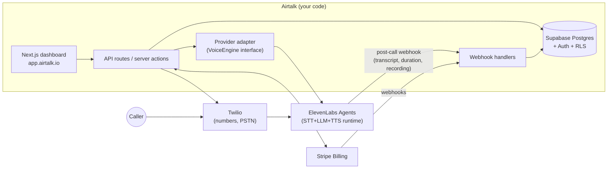

# Airtalk.io — SaaS Platform Architecture (RFC)

_Status: Draft · Author: Tanjir · Date: 2026-07-12_
_From "done-for-you agents on Retell" to a self-serve voice-agent SaaS, built solo._

## 1. The core idea

You don't need to build a voice platform. You need to build a **control plane** on top of one.

A voice-agent provider (ElevenLabs Agents, Retell, Vapi) already runs the hard part — the real-time pipeline of speech-to-text → LLM → text-to-speech, with sub-second latency, interruption handling, and native Twilio telephony. Airtalk's product is everything around it:

- **Multi-tenancy** — customers, workspaces, isolation
- **Self-serve agent builder** — templates + wizard instead of raw provider config
- **Phone numbers** — buy/attach via Twilio API, invisible to the customer
- **Call logs, transcripts, analytics** — the dashboard customers actually look at
- **Billing & metering** — plans, minute caps, overages (this is where margin lives)

The customer never sees ElevenLabs or Twilio. They see Airtalk.

**Important simplification:** you do NOT wire ElevenLabs + Twilio together yourself. ElevenLabs Agents has a *native Twilio integration* — you register a Twilio number with ElevenLabs via API and their platform answers/places the calls. Your backend never touches audio. Same for Retell.

## 2. Goals / Non-goals

**Goals (MVP):** self-serve signup → create agent from template → get a phone number → receive calls → see transcripts → pay monthly. Migrate existing done-for-you clients onto it.

**Non-goals (for now):** building your own STT/LLM/TTS pipeline, white-label/agency reselling, BYO SIP carrier, HIPAA, public API. These are Phase 3+ or "when revenue demands it."

## 3. Provider choice

| | **ElevenLabs Agents** (recommended) | **Retell** | **Vapi** |
|---|---|---|---|
| Engine cost | $0.08/min (incl. STT+TTS+orchestration; LLM + telephony extra) | ~$0.07/min + LLM ($0.003–0.08) + telephony | $0.05/min orchestration only; everything else à la carte |
| Telephony | Native Twilio integration + SIP trunking, API-managed | Native Twilio / own SIP | BYO mostly |
| Agent CRUD API | Yes (`POST /v1/convai/agents/create`) | Yes (pure developer infra) | Yes |
| Outbound batch calling | Yes, API-driven | Yes | Yes |
| Notes | Best-in-class voices; plans bundle minutes + concurrency caps | You already know it — real option | Most modular = most bills to reconcile |

**Recommendation: ElevenLabs Agents** — one bill covers voice+STT+orchestration, best voice quality (a real selling point for "human-like"), batch calling and Twilio registration all API-driven. Retell is a legitimate alternative given your existing experience; the adapter layer below makes this a two-way door.

⚠️ **Concurrency is the hidden ceiling.** ElevenLabs plans cap simultaneous calls (e.g., Pro ≈ 20, Scale ≈ 30, Business ≈ 40 concurrent). All your tenants share this pool. Watch peak concurrency, not just minutes — it's what forces plan upgrades.

## 4. Unit economics (the part that decides if this business works)

Estimated all-in cost per call minute (ElevenLabs path):

| Component | $/min |
|---|---|
| ElevenLabs Agents | 0.080 |
| LLM (budget model, billed via ElevenLabs) | ~0.010–0.020 |
| Twilio (inbound $0.0085 / outbound ~$0.014) | ~0.010–0.015 |
| **Total** | **~$0.10–0.12** → plan with **$0.13** |

Pricing (v2, July 2026 — annual = 15% off). Margins assume 100% minute usage at the conservative $0.13/min; real margins run higher:

| Plan | Price | Minutes | Agents | Features | Cost @$0.13 | Margin (monthly) | Margin (annual) |
|---|---|---|---|---|---|---|---|
| Starter | $499 | 750 | 1 | Core | $98 | **$402 (80.5%)** | $327 (77.0%) |
| Growth | $999 | 1,500 | 3 | + Knowledge base | $195 | **$804 (80.5%)** | $654 (77.0%) |
| Pro | $1,499 | 2,500 | 5 | + Adaptive learning | $325 | **$1,174 (78.3%)** | $949 (74.5%) |

All caps are hard — no "unlimited" anywhere. Sell overage at **$0.30–0.40/min** (industry norm, ~60%+ margin). Per-number cost ($1.15/mo Twilio) is noise.

**Differentiators cost ~nothing, by design:** agent count is a `max_agents` plan limit in the wizard; knowledge base gates ElevenLabs' native per-agent RAG behind a plan flag; adaptive learning = weekly cron + LLM pass over transcripts producing suggested prompt/KB improvements with one-click apply ("your agent learned 12 new answers this month"). Only minutes drive real cost.

## 5. Architecture



**Solo-dev stack:** Next.js (App Router) on Vercel · Supabase (Postgres, Auth, RLS, Storage) · Stripe Billing · ElevenLabs + Twilio SDKs · Sentry. One repo, no microservices, no queue until outbound campaigns need one (then Inngest/QStash). Keep the WordPress site as marketing at `airtalk.io`; app lives at `app.airtalk.io`.

**The adapter is your insurance.** Define your own interface — `createAgent()`, `updateAgent()`, `attachNumber()`, `startBatchCall()`, `normalizeCallEvent()` — and put all ElevenLabs calls behind it. Your DB stores `provider` + `provider_agent_id`, never provider-specific shapes in core tables. Swapping to Retell, or to your own Pipecat pipeline at scale, becomes a new adapter, not a rewrite.

## 6. Data model

```sql
orgs            (id, name, plan_id, stripe_customer_id, minutes_cap, created_at)
org_members     (org_id, user_id, role)                     -- users via Supabase Auth
agents          (id, org_id, name, template, provider, provider_agent_id,
                 config jsonb, status)                      -- config = prompt, voice, tools
phone_numbers   (id, org_id, agent_id, e164, twilio_sid, provider_number_id, status)
calls           (id, org_id, agent_id, provider_call_id UNIQUE, direction,
                 from_e164, to_e164, started_at, duration_secs, transcript jsonb,
                 recording_url, cost_cents, outcome, status)
usage_periods   (org_id, period_start, minutes_used, minutes_cap, overage_minutes)
campaigns       (id, org_id, agent_id, name, status, calling_window, spend_cap_cents)
campaign_contacts (id, campaign_id, e164, vars jsonb, call_id, status)
webhook_events  (id, provider, event_id UNIQUE, payload jsonb, processed_at)  -- idempotency
```

Postgres RLS on `org_id` gives tenant isolation for free with Supabase. Access patterns are trivial at this scale (thousands of calls/day = nothing); index `calls (org_id, started_at DESC)` and you're done for years.

## 7. Critical flows

**Onboard:** signup → create org → Stripe Checkout → wizard picks template (Receptionist / Booking / Lead Qualifier) → fills business info → adapter creates provider agent → buy Twilio number via API → register number with ElevenLabs → attach to agent → test call in browser (ElevenLabs web widget — great "aha" moment).

**Inbound call:** caller → Twilio number → ElevenLabs runs the conversation → `post_call` webhook → verify signature → upsert on `provider_call_id` (idempotent) → store transcript/duration/recording → increment `usage_periods` → if over cap: email + auto-overage (card on file) or pause agent per org setting.

**Outbound campaign (Phase 2):** CSV upload → validate + dedupe against opt-outs → batch-calling API within allowed calling window → per-call webhooks update contacts. Hard spend-cap and a kill switch per campaign, from day one.

**Metering truth:** webhooks will occasionally be missed. Nightly job pulls the provider's call-list API and reconciles against `calls` — usage data is billing data; it must be reconciled, not trusted.

**Tools/integrations:** appointment booking = provider "tool call" hitting your endpoint → Cal.com API (you already use cal.com) → confirm slot in-conversation. CRM push (HubSpot/Pipedrive) is a post-call webhook side-effect. Start with Cal.com only.

## 8. Failure modes

| Failure | Impact | Mitigation |
|---|---|---|
| ElevenLabs outage | All tenants' calls fail | Status page + status webhooks → banner; Twilio fallback voicemail TwiML; adapter enables multi-provider later |
| Missed webhook | Undercounted usage / missing transcript | Idempotent upserts + nightly reconciliation |
| Runaway outbound campaign | Burned spend, TCPA exposure | Per-org spend caps, calling windows, kill switch, opt-out list checked before dial |
| Customer blows past cap | Your margin gone | Hard cap enforcement + auto-overage billing; no true "unlimited" anywhere |
| Concurrency pool exhausted (shared across tenants) | Busy-hour calls rejected | Monitor peak concurrent calls; upgrade ElevenLabs tier ahead of the curve; per-org concurrency limits |
| Twilio compliance (SHAKEN/STIR, KYC) | Numbers flagged as spam | Complete Twilio trust/business verification early; register outbound traffic properly |

## 9. Compliance — take seriously before self-serve

- **Outbound = TCPA territory** (US): consent-based lists only, DNC scrubbing, calling hours, instant opt-out. Fines are per-call. Gate outbound behind a review step at first.
- **Recording consent:** several US states require two-party consent; add a disclosure line to agent greetings by default. Several states now also require **disclosing the caller is AI** — keep the disclosure default ON.
- **Website cleanup before launch:** the site currently claims SOC 2 compliance, shows press logos (TechCrunch/Forbes), "500+ businesses / 2M calls," a placeholder phone number, and leftover "VoiceAI" branding. Self-serve customers (and lawyers) will check. Replace with what's true — the honest version still sells.

## 10. Alternatives considered

- **Stay on Retell as engine** — viable, you know it; slightly cheaper engine but you'd still buy TTS quality à la carte. Adapter keeps this open.
- **Buy a white-label wrapper** (VoiceAIWrapper, Awaz, ChatDash) — fastest to market, but you rent your product forever, can't differentiate, and margin goes to them. Reasonable as a stopgap, wrong as the destination you've chosen.
- **Build own pipeline (Pipecat/LiveKit + Deepgram + ElevenLabs TTS)** — cuts engine cost toward ~$0.04–0.06/min at scale, but months of real-time engineering solo. Revisit when engine spend > ~$3–5k/mo; the adapter makes it an incremental migration.

## 11. Build plan (solo, ~6 weeks to MVP)

- **Wk 1–2:** Supabase schema + auth + orgs · Stripe plans/checkout/webhooks · dashboard shell
- **Wk 2–3:** provider adapter · agent templates + creation wizard · browser test-call widget
- **Wk 3–4:** Twilio number purchase + ElevenLabs registration · inbound end-to-end · call log + transcript view
- **Wk 4–5:** usage metering, caps, overage billing · reconciliation job · Sentry + alerts
- **Wk 5–6:** onboarding polish · migrate 2–3 existing done-for-you clients as design partners · fix pricing page (kill "unlimited")
- **Phase 2 (wk 7–12):** outbound campaigns + TCPA guardrails · Cal.com booking tool · analytics dashboard
- **Phase 3:** HubSpot/Pipedrive, public API, agency/white-label tier — only once MVP retains customers

Keep selling done-for-you the whole time — it funds the build and every manual setup is requirements research for the wizard.

## 12. Open questions

1. ElevenLabs plan tier at launch (drives concurrency ceiling) — model expected peak concurrent calls from current clients.
2. Overage price point ($0.30–0.40/min) and whether Starter gets overage or hard-stops.
3. Twilio numbers in one account vs. subaccount-per-tenant (subaccounts = cleaner isolation, more API plumbing; single account is fine for MVP).
4. Recording storage: provider-hosted URLs vs. copying to Supabase Storage (retention control vs. cost).

---

**Pricing sources (July 2026):** [ElevenLabs Agents pricing](https://elevenlabs.io/pricing/agents) · [ElevenLabs price cut announcement](https://elevenlabs.io/blog/weve-lowered-api-agents-pricing-and-introduced-pay-as-you-go) · [Retell pricing](https://www.retellai.com/pricing) · [Retell real-cost breakdown](https://www.cekura.ai/blogs/retell-ai-pricing-per-minute) · [Vapi cost breakdown](https://www.cekura.ai/blogs/vapi-ai-pricing) · [Twilio voice pricing](https://www.twilio.com/en-us/voice/pricing/us) · [ElevenLabs agent-create API](https://elevenlabs.io/docs/api-reference/agents/create) · [ElevenLabs batch calling](https://elevenlabs.io/docs/agents-platform/phone-numbers/batch-calls) · [ElevenLabs SIP/Twilio integration](https://elevenlabs.io/agents/integrations/twilio). Verify rates before finalizing your pricing page — providers changed prices twice in the last year.
